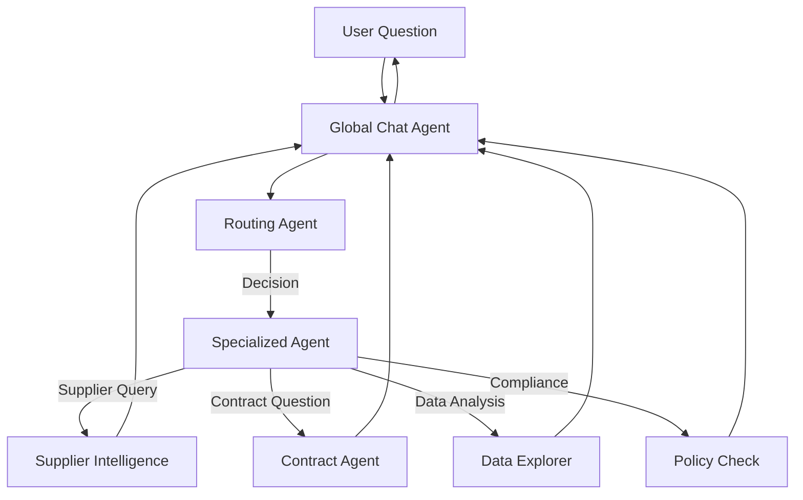
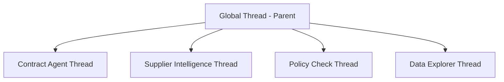
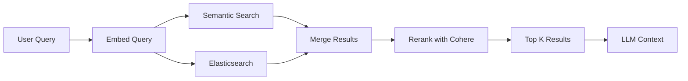
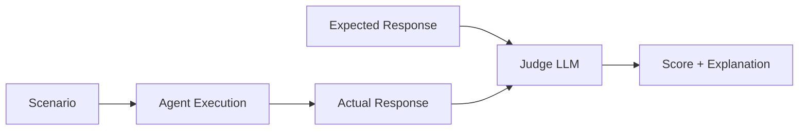

# Multi-Agent Architecture with Ruby & the AI Open-Source Ecosystem

**Building Production AI Systems Without Frameworks**

---

## About Me

**Szymon Kurcab**
- Head of AI Labs and Engineering Operation at Tropic Technologies
- LinkedIn: [linkedin.com/in/szymonk](https://www.linkedin.com/in/szymonk/)
- Building AI-powered procurement intelligence


---

## About Tropic

> Enterprise software procurement platform powered by AI

- **Supplier Intelligence**: AI-driven vendor analysis and negotiation insights
- **Contract Management**: Smart document processing and compliance checking
- **Spend Optimization**: Data-driven procurement recommendations
- **AI-First Architecture**: Multi-agent system at the core

*Notes: Tropic helps companies manage SaaS procurement with AI agents that answer questions, analyze contracts, and provide negotiation guidance.*

---

## Today's Agenda

1. GenAI Ecosystem Evolution (2023 → 2025)
2. Multi-Agent Architecture
3. RAG Implementation
4. AI Evaluations & MCP
5. Ruby-Specific Learnings

*Notes: 40-minute talk focusing on practical patterns, not code. Based on production system at scale.*

---

# The GenAI Ecosystem Evolution

---

## 2023: The Gold Rush

- **Framework explosion**: LangChain, LlamaIndex, AutoGPT
- **Python dominance**: Every library, tutorial, framework
- **Ruby situation**: Ports, thin wrappers, or nothing
- **Developer mindset**: "I need a framework to do AI"

*Notes: Everyone rushed to build frameworks. Ruby community waiting for mature libraries that never came.*

---

## 2024: Framework Fatigue

- **Complexity overhead**: Abstractions hiding simple API calls
- **Version churn**: Breaking changes every week
- **Lock-in**: Framework decisions hard to reverse
- **Debugging nightmares**: 5 layers between you and the API

```
User Request → Framework → Abstraction → Another Abstraction → API
```

*Notes: Realized frameworks added complexity without value. Simple chat completions became multi-file configurations.*

---

## 2025: Back to Basics

- **API-first approach**: Direct OpenAI/Anthropic SDK usage
- **Framework skepticism**: "Do I really need this?"
- **Simplicity wins**: 50 lines of code vs 500 lines of config
- **Anthropic's guidance**: [Building Effective Agents](https://www.anthropic.com/engineering/building-effective-agents)

> "Agents are just LLMs calling tools in a loop"

*Notes: Anthropic's blog post validated the simple approach. Most "AI orchestration" is unnecessary.*

---

## Ruby's Unique Position

**Having fewer options forced better architectural decisions**

- ❌ No mature LangChain equivalent
- ❌ No complex RAG frameworks
- ✅ Direct API usage from day one
- ✅ Clean service architecture
- ✅ Explicit over implicit

*Notes: Ruby's lack of AI libraries was actually an advantage. Built on solid patterns: services, objects, explicit dependencies.*

---

# Multi-Agent Architecture

---

## Agent Types in Our System

### One-Off Agents
- Single task execution
- No conversation history
- Example: Document summarization, data extraction

### Chat-Based Agents
- Stateful conversations
- Thread management
- Example: Global assistant, contract Q&A

**11+ specialized agents** orchestrated by routing

*Notes: Not all agents need memory. One-off agents are cheaper and faster for simple tasks.*

---

## Global Chat Agent Architecture



*Notes: Global agent is the user-facing interface. Routing agent decides which specialist handles the request. Response flows back through global agent for unified UX.*

---

## The Routing Agent: Traffic Controller

**Lightweight decision-maker**

- Uses **fast, cheap model** (gpt-4o-mini)
- Analyzes user intent + context
- Routes to specialized agent
- No heavy lifting, just decisions

### Example Flow
```
User: "What's our spend with Salesforce?"
  ↓
Router: "This is supplier intelligence" → SupplierAgent
  ↓
SupplierAgent: Fetches data, analyzes, formats response
  ↓
Global: Shows response to user
```

*Notes: Routing is fast (<500ms). Like a reverse proxy for AI. The router doesn't do work, just directs traffic.*

---

## Agent Orchestration

### 11+ Specialized Agents

- **Supplier Intelligence**: Vendor analysis, price benchmarking
- **Contract Agent**: RAG-powered contract Q&A
- **Data Explorer**: Natural language → SQL queries
- **Policy Compliance**: Contract vs policy checking
- **Create Request**: Guided form filling
- **Gong/Front AMA**: Integration-specific assistants

Each agent: **Single responsibility, expert in domain**

*Notes: Each agent has specific tools and knowledge. Better than one mega-agent trying to do everything.*

---

## Thread Hierarchy



**Each sub-agent has its own isolated thread:**
- Global thread is the parent for all sub-agents
- Sub-agents don't share threads with each other
- Isolation ensures clean context boundaries

*Notes: Global thread owns all sub-agent threads. Each sub-agent operates in isolation with its own thread. No thread sharing between sub-agents. Database-backed, not in-memory.*

---

## Real Example: Multi-Agent Flow

**User**: "Check if our Gong contract complies with our SaaS policy"

1. **Global Agent**: Receives question, shows to user
2. **Routing Agent**: Identifies policy compliance task
3. **Policy Compliance Agent**:
   - Loads contract via RAG
   - Loads policy documents
   - Compares terms
   - Identifies gaps
4. **Global Agent**: Presents formatted results
5. **Routing Agent**: Updated with outcome for context

**Total time**: ~3-5 seconds | **User sees**: Streaming response

*Notes: User doesn't see agent switching. Seamless experience. Each agent uses different tools and knowledge bases.*

---

# RAG Implementation

---

## Contextual Retrieval

Following Anthropic's [Contextual Retrieval](https://www.anthropic.com/engineering/contextual-retrieval) approach:

### The Problem
- Traditional RAG: Chunks lose context
- "The renewal term is 12 months" → Which contract?
- Semantic search alone: Not enough

### The Solution
- **Hybrid search**: Multiple retrieval strategies
- **Reranking**: Quality > quantity
- **Contextual chunks**: Metadata-enriched

*Notes: Anthropic's blog showed 67% reduction in retrieval failures with contextual retrieval. We implemented similar pattern.*

---

## Hybrid Search: 3-Stage Pipeline



### Why Hybrid?
- **Semantic**: Conceptual matches (embeddings)
- **Elasticsearch**: Keyword/exact matches
- **Reranking**: Cross-encoder scoring (Cohere)

*Notes: Each search strategy catches different things. Semantic finds conceptual matches, ES finds exact terms. Reranking uses better model to score relevance.*

---

## The 3 Stages

### 1. Semantic Search
- **Embeddings**: OpenAI `text-embedding-3-large` (1024 dimensions)
- **Vector DB**: Elasticsearch with cosine similarity
- **Returns**: Top 15 chunks (score > 1.2)

### 2. Elasticsearch Search
- **Full-text search**: BM25 ranking
- **Filters**: Organization, document type, namespace
- **Returns**: Top 5 keyword matches

### 3. Reranking
- **Cohere Rerank API**: Cross-encoder model
- **Input**: Combined results (up to 20 chunks)
- **Output**: Top 10 chunks (relevance score > 0.1)

*Notes: Start wide (20 chunks), narrow down to best 10. Reranking is expensive but accurate. Only used when quality matters (contracts, policies).*

---

## Chunking & Embedding Strategy

### Document Processing
1. **Extract text** from PDFs, DOCX
2. **Chunk with RecursiveCharacterTextSplitter**: Splits by hierarchy (paragraphs → sentences → words), tries largest units first, falls back if too big
3. **Add context**: Document summary, name, type, organization
4. **Embed chunks**: Async background jobs
5. **Store**: Elasticsearch with namespace scoping

### Namespace Scoping
```
{env}-{org-slug}-{org-id}-{document-id}
```

**Why?** Multi-tenancy, security, fast filtering

*Notes: Namespaces ensure users only search their org's data. Chunking preserves context by keeping document metadata with each chunk.*

---

# AI Evaluations & MCP

---

## LLM-as-Judge Pattern

**How do you test AI quality?**

### Traditional Approach
- Manual review (doesn't scale)
- Regex matching (too brittle)

### Our Approach: LLM-as-Judge
1. **Scenarios**: Test prompts + expected outcomes
2. **Judges**: Evaluation rubrics
3. **Runs**: Execute scenarios, collect responses
4. **Scoring**: Another LLM grades the output (0 or 100)

*Notes: Use AI to evaluate AI. Works well for open-ended responses where exact matching fails. Can run 50+ scenarios automatically.*

---

## Evaluation Framework



### Example Judge Rubric
> "Score 100 if the response correctly identifies all contract renewal terms and dates. Score 0 if any term is missed or incorrect."

**Benefits**: Regression testing, prompt iteration, model comparison

*Notes: Judge rubrics are the key. Clear criteria = consistent scoring. Can compare GPT-4 vs Claude responses objectively.*

---

## MCP: Model Context Protocol

**Expose your tools to external LLMs (ChatGPT, Claude)**

### What is MCP?
- Open protocol by Anthropic
- LLM clients can call your APIs
- Standard tool/resource format

### Our Implementation
- **8 MCP tools** exposed
- **OAuth authentication** for ChatGPT
- **Examples**: Supplier intelligence, price benchmarking, contract search

*Notes: MCP lets ChatGPT users access Tropic data directly. "Hey ChatGPT, check if $30/user/month for Zoom is a good price" → calls our MCP server.*

---

# Ruby-Specific Learnings

---

## Why Skip Frameworks?

### What We Chose
- ✅ Direct API usage (OpenAI/Anthropic SDKs)
- ✅ Service objects for agents
- ✅ Simple tool registration
- ✅ Explicit dependencies

### What We Avoided
- ❌ Ruby ports of Python frameworks
- ❌ DSLs for agent configuration
- ❌ Magic/metaprogramming
- ❌ Framework lock-in

**Result**: ~120 agent service files, each <200 lines

*Notes: Service pattern scales well. Each agent is a class with clear inputs/outputs. Easy to test, debug, understand.*

---

## API-First Architecture

### Provider Abstraction Layer

```ruby
# Pseudocode - conceptual example
client = AIClient.get_client(provider: "openai")
response = client.chat(messages: [...], tools: [...])

# Switch providers via feature flag
client = AIClient.get_client(provider: "anthropic")
response = client.chat(messages: [...], tools: [...])
```

**Benefits**:
- A/B test GPT-4 vs Claude
- Cost optimization (route by task)
- No vendor lock-in

*Notes: Built thin abstraction over APIs. Can switch models per-user via feature flags. Price-sensitive tasks use cheaper models.*

---

## Architectural Benefits

### Patterns That Worked

**1. Service Pattern**
- Each agent is a service class
- Single responsibility
- Easy to test and compose

**2. Result Objects**
- Consistent success/failure handling
- No exceptions for control flow
- Explicit error states

**3. Multi-Tenancy**
- Organization scoping at DB level
- Automatic in all queries
- Security by default

*Notes: These aren't AI-specific. Good Rails patterns applied to AI domain. Multi-tenancy especially critical - can't leak data between orgs.*

---

## Key Takeaways

### 1. Simple > Complex
Direct API calls beat framework abstractions

### 2. Specialized Agents > One Agent
11 experts better than 1 generalist

### 3. Hybrid RAG > Single Strategy
Combine semantic + keyword + reranking

### 4. Ruby Can Do AI
Missing libraries forced better architecture

### 5. Test with LLM-as-Judge
Automate evaluation of open-ended outputs

---

## Resources

- **Building Effective Agents**: [anthropic.com/engineering/building-effective-agents](https://www.anthropic.com/engineering/building-effective-agents)
- **Contextual Retrieval**: [anthropic.com/engineering/contextual-retrieval](https://www.anthropic.com/engineering/contextual-retrieval)
- **Tropic**: [tropicapp.io](https://www.tropicapp.io/)
- **Connect**: [linkedin.com/in/szymonk](https://www.linkedin.com/in/szymonk/)

---

# Questions?

**Thank you!**

*szymon@tropicapp.io*

---

## Appendix: System Stats

For the curious:

- **123 AI service files** in production
- **11+ specialized agents**
- **16 internal tools** for function calling
- **8 MCP tools** for external access
- **3-stage RAG pipeline**: Semantic + ES + Rerank
- **Provider agnostic**: OpenAI ↔ Anthropic switching
- **Thread-based architecture**: Parent-child communication
- **Evaluation framework**: LLM-as-judge pattern

*Notes: These numbers show scale without showing code. Production-grade system built on simple patterns.*
