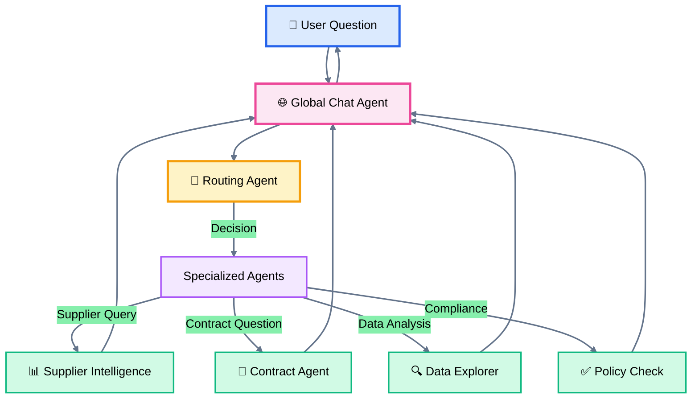
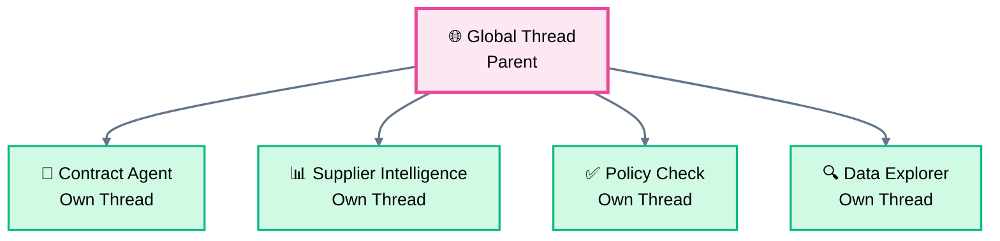
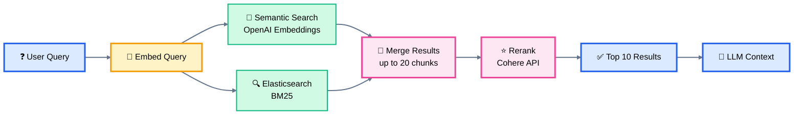
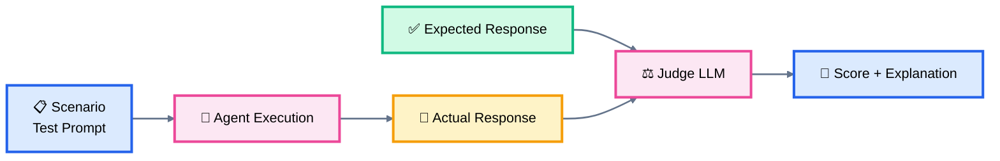

# Multi-Agent Architecture with Ruby & the AI Open-Source Ecosystem

**Building Production AI Systems Without Frameworks**

<div class="pt-12">
  <span @click="$slidev.nav.next" class="px-2 py-1 rounded cursor-pointer" hover="bg-white bg-opacity-10">
    Press Space for next page <carbon:arrow-right class="inline"/>
  </span>
</div>

---
layout: two-cols
---

## About Me

**Szymon Kurcab**
- Head of AI Labs and Engineering Operation at Tropic Technologies
- Building AI-powered procurement intelligence

<br>

**Connect**
- LinkedIn: [linkedin.com/in/szymonk](https://www.linkedin.com/in/szymonk/)
- Email: szymon.kurcab@gmail.com


::right::

<div class="pl-10">

### Today's Focus

✅ Multi-agent orchestration

✅ RAG at scale

✅ Ruby without frameworks

✅ Production patterns

</div>

<!--
Tropic helps companies manage SaaS procurement with AI agents
-->

---

## About Tropic

<v-clicks>

> **Enterprise software procurement platform powered by AI**

- 🔍 **Supplier Intelligence**: AI-driven vendor analysis and negotiation insights
- 📄 **Contract Management**: Smart document processing and compliance checking
- 💰 **Spend Optimization**: Data-driven procurement recommendations
- 🤖 **AI-First Architecture**: Multi-agent system at the core

</v-clicks>

<!--
Tropic helps companies manage SaaS procurement with AI agents that answer questions, analyze contracts, and provide negotiation guidance
-->

---
layout: center
class: text-center
---

## Today's Agenda

<div class="grid grid-cols-2 gap-4 pt-4 text-left">

<div v-click>

### 🌊 The Evolution
2023 → 2025: From frameworks to APIs

</div>

<div v-click>

### 🤖 Multi-Agent
11+ specialized agents working together

</div>

<div v-click>

### 📚 RAG Pipeline
Hybrid search + contextual retrieval

</div>

<div v-click>

### 💎 Ruby Learnings
Why fewer options = better decisions

</div>

</div>

<!--
40-minute talk focusing on practical patterns, not code. Based on production system at scale.
-->

---
layout: section
---

# The GenAI Ecosystem Evolution

From framework chaos to API simplicity

---

## 2023: The Gold Rush

<v-clicks>

- 💥 **Framework explosion**: LangChain, LlamaIndex, AutoGPT
- 🐍 **Python dominance**: Every library, tutorial, framework
- 💎 **Ruby situation**: Ports, thin wrappers, or nothing
- 🤔 **Developer mindset**: "I need a framework to do AI"

</v-clicks>

<v-click>

<div class="mt-8 p-4 bg-red-500 bg-opacity-10 rounded">

**Problem**: Ruby community waiting for mature libraries that never came

</div>

</v-click>

<!--
Everyone rushed to build frameworks. Ruby community waiting for mature libraries that never came.
-->

---

## 2024: Framework Fatigue

<v-clicks>

- 🏗️ **Complexity overhead**: Abstractions hiding simple API calls
- 🔄 **Version churn**: Breaking changes every week
- 🔒 **Lock-in**: Framework decisions hard to reverse
- 🐛 **Debugging nightmares**: 5 layers between you and the API

</v-clicks>

<v-click>

```
User Request → Framework → Abstraction → Another Abstraction → API
```

</v-click>

<v-click>

<div class="mt-4 p-4 bg-yellow-500 bg-opacity-10 rounded">

**Realization**: Simple chat completions became multi-file configurations

</div>

</v-click>

<!--
Realized frameworks added complexity without value. Simple chat completions became multi-file configurations.
-->

---

## 2025: Back to Basics

<v-clicks>

- ⚡ **API-first approach**: Direct OpenAI/Anthropic SDK usage
- 🤨 **Framework skepticism**: "Do I really need this?"
- ✨ **Simplicity wins**: 50 lines of code vs 500 lines of config
- 📖 **Anthropic's guidance**: [Building Effective Agents](https://www.anthropic.com/engineering/building-effective-agents)

</v-clicks>

<v-click>

<div class="mt-8 text-2xl text-center">

> "Agents are just LLMs calling tools in a loop"
>
> — Anthropic Engineering Blog

</div>

</v-click>

<!--
Anthropic's blog post validated the simple approach. Most "AI orchestration" is unnecessary.
-->

---
layout: two-cols
---

## Ruby's Unique Position

**Having fewer options forced better architectural decisions**

<v-clicks>

### ❌ What Ruby Lacked
- No mature LangChain equivalent
- No complex RAG frameworks
- No "magic" AI libraries

</v-clicks>

::right::

<v-clicks>

### ✅ What We Gained
- Direct API usage from day one
- Clean service architecture
- Explicit over implicit
- Standard Rails patterns

</v-clicks>

<!--
Ruby's lack of AI libraries was actually an advantage. Built on solid patterns: services, objects, explicit dependencies.
-->

---
layout: section
---

# Multi-Agent Architecture

11+ specialists, one system

---

## Agent Types in Our System

<div class="grid grid-cols-2 gap-8 mt-8">

<div v-click>

### ⚡ One-Off Agents
- Single task execution
- No conversation history
- Fast & cheap

**Examples**
- Document summarization
- Data extraction

</div>

<div v-click>

### 💬 Chat-Based Agents
- Stateful conversations
- Thread management
- Context preservation

**Examples**
- Global assistant
- Contract Q&A

</div>

</div>

<v-click>

<div class="mt-8 text-center text-xl">

**11+ specialized agents** orchestrated by routing

</div>

</v-click>

<!--
Not all agents need memory. One-off agents are cheaper and faster for simple tasks.
-->

---

## Global Chat Agent Architecture



<!--
Global agent is the user-facing interface. Routing agent decides which specialist handles the request. Response flows back through global agent for unified UX.
-->

---

## The Routing Agent: Traffic Controller

<v-clicks>

**Lightweight decision-maker**

- 🚀 Uses **fast, cheap model** (gpt-4o-mini)
- 🎯 Analyzes user intent + context
- 📍 Routes to specialized agent
- 💨 No heavy lifting, just decisions

</v-clicks>

<v-click>

### Example Flow

````md magic-move
```
User: "What's our spend with Salesforce?"
```
```
User: "What's our spend with Salesforce?"
  ↓
Router: "This is supplier intelligence"
```
```
User: "What's our spend with Salesforce?"
  ↓
Router: "This is supplier intelligence" → SupplierAgent
  ↓
SupplierAgent: Fetches data, analyzes, formats response
```
```
User: "What's our spend with Salesforce?"
  ↓
Router: "This is supplier intelligence" → SupplierAgent
  ↓
SupplierAgent: Fetches data, analyzes, formats response
  ↓
Global: Shows response to user ✨
```
````

</v-click>

<!--
Routing is fast (<500ms). Like a reverse proxy for AI. The router doesn't do work, just directs traffic.
-->

---

## Agent Orchestration

### 11+ Specialized Agents

<div class="grid grid-cols-2 gap-6 mt-4 text-sm">

<v-clicks>

- 📊 **Supplier Intelligence**: Vendor analysis, price benchmarking
- 📄 **Contract Agent**: RAG-powered contract Q&A
- 🔍 **Data Explorer**: Natural language → SQL queries
- ✅ **Policy Compliance**: Contract vs policy checking
- 📝 **Create Request**: Guided form filling
- 🎙️ **Gong/Front AMA**: Integration-specific assistants

</v-clicks>

</div>

<v-click>

<div class="mt-8 p-4 bg-blue-500 bg-opacity-10 rounded">

**Principle**: Each agent has **single responsibility**, expert in its domain

</div>

</v-click>

<!--
Each agent has specific tools and knowledge. Better than one mega-agent trying to do everything.
-->

---

## Thread Hierarchy



<div class="mt-6 text-sm">

**Each sub-agent has its own isolated thread:**
- 🌐 Global thread is the parent for all sub-agents
- 🧵 Sub-agents don't share threads with each other
- 🔒 Isolation ensures clean context boundaries

</div>

<!--
Threads form a tree. Parent knows about all children. Siblings can access each other's resources. Database-backed, not in-memory.
-->

---

## Real Example: Multi-Agent Flow

**User**: _"Check if our Gong contract complies with our SaaS policy"_

<v-clicks>

1. 🌐 **Global Agent**: Receives question, shows to user
2. 🚦 **Routing Agent**: Identifies policy compliance task
3. ✅ **Policy Compliance Agent**:
   - Loads contract via RAG
   - Loads policy documents
   - Compares terms
   - Identifies gaps
4. 🌐 **Global Agent**: Presents formatted results
5. 🚦 **Routing Agent**: Updated with outcome for context

</v-clicks>

<v-click>

<div class="mt-6 grid grid-cols-2 gap-6 text-sm">
<div class="p-3 bg-green-500 bg-opacity-10 rounded">
⏱️ Total time: ~3-5 seconds
</div>
<div class="p-3 bg-blue-500 bg-opacity-10 rounded">
👁️ User sees: Streaming response
</div>
</div>

</v-click>

<!--
User doesn't see agent switching. Seamless experience. Each agent uses different tools and knowledge bases.
-->

---
layout: section
---

# RAG Implementation

Hybrid search + contextual retrieval

---

## Contextual Retrieval

Following Anthropic's [Contextual Retrieval](https://www.anthropic.com/engineering/contextual-retrieval) approach

<div class="grid grid-cols-2 gap-8 mt-8">

<div v-click>

### ❌ The Problem
- Traditional RAG: Chunks lose context
- _"The renewal term is 12 months"_
  - Which contract?
- Semantic search alone: Not enough

</div>

<div v-click>

### ✅ The Solution
- **Hybrid search**: Multiple retrieval strategies
- **Reranking**: Quality > quantity
- **Contextual chunks**: Metadata-enriched

</div>

</div>

<v-click>

<div class="mt-8 p-4 bg-green-500 bg-opacity-10 rounded">

**Result**: 67% reduction in retrieval failures (Anthropic's research)

</div>

</v-click>

<!--
Anthropic's blog showed 67% reduction in retrieval failures with contextual retrieval. We implemented similar pattern.
-->

---

## Hybrid Search: 3-Stage Pipeline



<v-clicks>

### Why Hybrid?
- 🧠 **Semantic**: Conceptual matches (embeddings)
- 🔍 **Elasticsearch**: Keyword/exact matches
- ⭐ **Reranking**: Cross-encoder scoring (Cohere)

</v-clicks>

<!--
Each search strategy catches different things. Semantic finds conceptual matches, ES finds exact terms. Reranking uses better model to score relevance.
-->

---

## The 3 Stages

<div class="grid grid-cols-3 gap-6 mt-4 text-sm">

<div v-click>

### 1️⃣ Semantic Search
- **Embeddings**: OpenAI `text-embedding-3-large`
- **Dimensions**: 1024
- **Vector DB**: Elasticsearch
- **Returns**: Top 15 chunks (score > 1.2)

</div>

<div v-click>

### 2️⃣ Elasticsearch
- **Full-text**: BM25 ranking
- **Filters**: Org, doc type, namespace
- **Returns**: Top 5 keyword matches

</div>

<div v-click>

### 3️⃣ Reranking
- **API**: Cohere Rerank
- **Model**: Cross-encoder
- **Input**: Combined results (up to 20)
- **Output**: Top 10 chunks (score > 0.1)

</div>

</div>

<v-click>

<div class="mt-8 p-4 bg-blue-500 bg-opacity-10 rounded text-center">

**Strategy**: Start wide (20 chunks), narrow down to best 10

</div>

</v-click>

<!--
Start wide (20 chunks), narrow down to best 10. Reranking is expensive but accurate. Only used when quality matters (contracts, policies).
-->

---

## Chunking & Embedding Strategy

<v-clicks>

### Document Processing Pipeline

1. 📄 **Extract text** from PDFs, DOCX
2. ✂️ **Chunk with RecursiveCharacterTextSplitter**
   - Splits by hierarchy: paragraphs → sentences → words
   - Tries largest units first, falls back if too big
3. 🏷️ **Add context**: Document summary, name, type, organization
4. 🔢 **Embed chunks**: Async background jobs
5. 💾 **Store**: Elasticsearch with namespace scoping

### Namespace Scoping

`{env}-{org-slug}-{org-id}-{document-id}`

**Why?** 🔒 Multi-tenancy, 🛡️ Security, ⚡ Fast filtering

</v-clicks>

<!--
Namespaces ensure users only search their org's data. Chunking preserves context by keeping document metadata with each chunk.
-->

---
layout: section
---

# AI Evaluations & MCP

Testing quality at scale

---

## LLM-as-Judge Pattern

**How do you test AI quality?**

<div class="grid grid-cols-2 gap-8 mt-8">

<div v-click>

### ❌ Traditional Approach
- Manual review (doesn't scale)
- Regex matching (too brittle)

</div>

<div v-click>

### ✅ Our Approach: LLM-as-Judge
1. **Scenarios**: Test prompts + expected outcomes
2. **Judges**: Evaluation rubrics
3. **Runs**: Execute scenarios, collect responses
4. **Scoring**: Another LLM grades (0 or 100)

</div>

</div>

<v-click>

<div class="mt-8 p-4 bg-green-500 bg-opacity-10 rounded text-center">

**Result**: Can run 50+ scenarios automatically for regression testing

</div>

</v-click>

<!--
Use AI to evaluate AI. Works well for open-ended responses where exact matching fails. Can run 50+ scenarios automatically.
-->

---

## Evaluation Framework



<v-click>

### Example Judge Rubric

> "Score 100 if the response correctly identifies all contract renewal terms and dates. Score 0 if any term is missed or incorrect."

</v-click>

<v-click>

**Benefits**: Regression testing, prompt iteration, model comparison

</v-click>

<!--
Judge rubrics are the key. Clear criteria = consistent scoring. Can compare GPT-4 vs Claude responses objectively.
-->

---

## MCP: Model Context Protocol

**Expose your tools to external LLMs (ChatGPT, Claude)**

<v-clicks>

### What is MCP?
- 🔌 Open protocol by Anthropic
- 🌐 LLM clients can call your APIs
- 🛠️ Standard tool/resource format

### Our Implementation
- **8 MCP tools** exposed
- **OAuth authentication** for ChatGPT
- **Examples**: Supplier intelligence, price benchmarking, contract search

</v-clicks>

<v-click>

<div class="mt-6 p-4 bg-blue-500 bg-opacity-10 rounded text-sm">

💬 **User asks ChatGPT**: _"Check if $30/user/month for Zoom is a good price"_

→ Calls our MCP server → Returns Tropic's price benchmarking data

</div>

</v-click>

<!--
MCP lets ChatGPT users access Tropic data directly. "Hey ChatGPT, check if $30/user/month for Zoom is a good price" → calls our MCP server.
-->

---
layout: section
---

# Ruby-Specific Learnings

Why fewer options = better decisions

---

## Why Skip Frameworks?

<div class="grid grid-cols-2 gap-8 mt-4 text-sm">

<div v-click>

### ✅ What We Chose
- Direct API usage (OpenAI/Anthropic SDKs)
- Service objects for agents
- Simple tool registration
- Explicit dependencies

</div>

<div v-click>

### ❌ What We Avoided
- Ruby ports of Python frameworks
- DSLs for agent configuration
- Magic/metaprogramming
- Framework lock-in

</div>

</div>

<v-click>

<div class="mt-8 p-4 bg-green-500 bg-opacity-10 rounded text-center text-xl">

**Result**: ~120 agent service files, each <200 lines

</div>

</v-click>

<!--
Service pattern scales well. Each agent is a class with clear inputs/outputs. Easy to test, debug, understand.
-->

---

## API-First Architecture

### Provider Abstraction Layer

```ruby
# Pseudocode - conceptual example
client = AIClient.get_client(provider: "openai")
response = client.chat(messages: [...], tools: [...])

# Switch providers via feature flag
client = AIClient.get_client(provider: "anthropic")
response = client.chat(messages: [...], tools: [...])
```

<v-clicks>

**Benefits**:
- 🧪 A/B test GPT-4 vs Claude
- 💰 Cost optimization (route by task)
- 🔓 No vendor lock-in

</v-clicks>

<!--
Built thin abstraction over APIs. Can switch models per-user via feature flags. Price-sensitive tasks use cheaper models.
-->

---

## Architectural Benefits

### Patterns That Worked

<v-clicks>

**1. Service Pattern**
- Each agent is a service class
- Single responsibility
- Easy to test and compose

**2. Result Objects**
- Consistent success/failure handling
- No exceptions for control flow
- Explicit error states

**3. Multi-Tenancy**
- Organization scoping at DB level
- Automatic in all queries
- Security by default

</v-clicks>

<!--
These aren't AI-specific. Good Rails patterns applied to AI domain. Multi-tenancy especially critical - can't leak data between orgs.
-->

---
layout: center
class: text-center
---

## Key Takeaways

<div class="grid grid-cols-1 gap-3 mt-4 text-left max-w-3xl mx-auto text-sm">

<div v-click class="p-3 bg-blue-500 bg-opacity-10 rounded">

**1. Simple > Complex** — Direct API calls beat framework abstractions

</div>

<div v-click class="p-3 bg-green-500 bg-opacity-10 rounded">

**2. Specialized Agents > One Agent** — 11 experts better than 1 generalist

</div>

<div v-click class="p-3 bg-purple-500 bg-opacity-10 rounded">

**3. Hybrid RAG > Single Strategy** — Combine semantic + keyword + reranking

</div>

<div v-click class="p-3 bg-red-500 bg-opacity-10 rounded">

**4. Ruby Can Do AI** — Missing libraries forced better architecture

</div>

<div v-click class="p-3 bg-yellow-500 bg-opacity-10 rounded">

**5. Test with LLM-as-Judge** — Automate evaluation of open-ended outputs

</div>

</div>

---

## Resources

<div class="grid grid-cols-2 gap-8 mt-12">

<div>

### 📚 References
- **Building Effective Agents**
  [anthropic.com/engineering/building-effective-agents](https://www.anthropic.com/engineering/building-effective-agents)

- **Contextual Retrieval**
  [anthropic.com/engineering/contextual-retrieval](https://www.anthropic.com/engineering/contextual-retrieval)

</div>

<div>

### 🔗 Connect
- **Tropic**: [tropicapp.io](https://www.tropicapp.io/)
- **LinkedIn**: [linkedin.com/in/szymonk](https://www.linkedin.com/in/szymonk/)
- **Email**: szymon.kurcab@gmail.com

</div>

</div>

---
layout: center
class: text-center
---

# Questions?

<div class="pt-12">
  <div class="text-3xl pb-4">
    Thank you!
  </div>
  <div class="opacity-80 pb-4">
    szymon.kurcab@gmail.com
  </div>
  
</div>

---

## Appendix: System Stats

<div class="grid grid-cols-2 gap-6 mt-8 text-sm">

<div v-click>

### 📊 Scale
- **123 AI service files** in production
- **11+ specialized agents**
- **16 internal tools** for function calling
- **8 MCP tools** for external access

</div>

<div v-click>

### 🏗️ Architecture
- **3-stage RAG pipeline**: Semantic + ES + Rerank
- **Provider agnostic**: OpenAI ↔ Anthropic switching
- **Thread-based**: Parent-child communication
- **LLM-as-judge**: Evaluation framework

</div>

</div>

<div v-click class="mt-8 p-4 bg-green-500 bg-opacity-10 rounded text-center">

**Production-grade system built on simple patterns**

</div>

<!--
These numbers show scale without showing code. Production-grade system built on simple patterns.
-->
